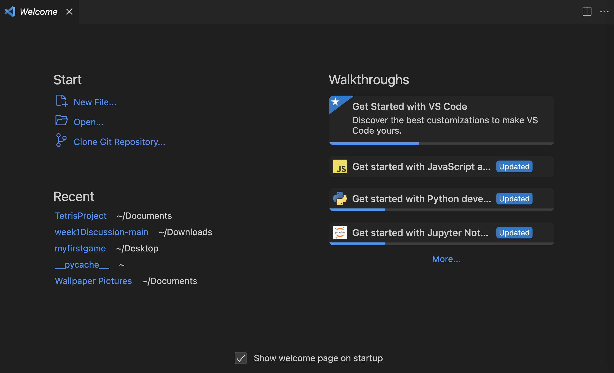
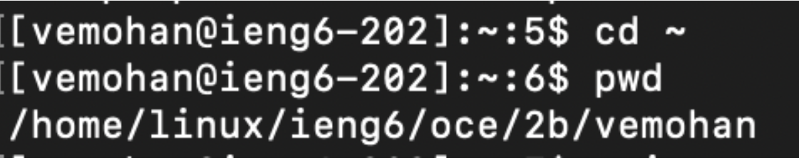

<h1> CSE 15l Lab Report 3 <h1>
  
For this lab report, I chose the grep command, and I am exploring the command-line options `-i, -v, -c, -l`. I found information on this
command on [wikipedia](https://en.wikibooks.org/wiki/Grep). 
<h3> `-i` <h3>
`-i` ignores upper and lower case when searching for lines
<h6> example 1 <h6>
```
  grep -i "six" biomed/1468-6708-3-1.txt
        Six large controlled population-based studies of
          examining health status over time, we added a sixth
```
<h6> example 2 <h6>
```
  grep -i "many" biomed/1468-6708-3-1.txt
        Many healthy older adults report gradual weight gain
          of health events in many studies [ 17 ] . Because we are
          results from many studies. However, health measures
```
<h3> `-v` <h3>
  `-v` inverts our match 
<h6> example 1 <h6>
```
 grep -v "e" 911report/chapter-1.txt
"WE HAVE SOME PLANES"
INSIDE THE FOUR FLIGHTS
IMPROVISING A HOMELAND DEFENSE
    NEADS: On its way towards Washington?
    NEADS: Okay.
NATIONAL CRISIS MANAGEMENT
What If?
```
<h6> example 2 <h6>
  We can also combine command-line options to ignore upper and lower cae
```
 grep -i -v "e" 911report/chapter-1.txt
What If?
```
  
<h3> `-c` <h3>
  `-c` outputs the count of matching lines 
<h6> example 1 <h6>
```
 grep -c "diversity" government/About_LSC/diversity_priorities.txt
44
```
<h6> example 2 <h6>
```
grep -c "hello" government/About_LSC/diversity_priorities.txt 
0
```
  
<h3> `-l` <h3>
 `-l` outputs matching files only
<h6> example 1 <h6>
```
 grep -l "chemical reaction" biomed/*.txt
biomed/1471-2105-3-38.txt
biomed/1471-2148-2-14.txt
biomed/1471-2164-3-19.txt
biomed/1471-2180-3-4.txt
biomed/1471-2229-1-2.txt
biomed/gb-2001-2-4-research0012.txt
biomed/gb-2002-3-5-research0024.txt
```
<h6> example 2 <h6>
```
grep -l "hammer" */*.txt
911report/chapter-12.txt
biomed/1471-2091-3-14.txt
biomed/1471-2105-3-14.txt
biomed/1471-2105-3-26.txt
biomed/1471-2407-2-18.txt
biomed/1472-6750-2-21.txt
```
Hey future students, I'll walk you through how to log into a course specific account on `ieng6`
<h3>Step 1</h3>
1. First, we will need to install VScode. When I tried this lab, I already had VScode installed, however, some of you might not. To download VScode, click on this [link](https://code.visualstudio.com/download) which will take you over to the download website. Simply follow the steps and you should have VScode set up fairly quickly. When you open VScode, it should look like this:

<h3>Step 2</h3>
2. Next, we will remotely connect to the remote server. To find your account username for the AD Domain, check out this [link](https://sdacs.ucsd.edu/~icc/index.php). By typing in your username and ID, you can find all your other AD Domain accounts. Check out this [link](https://drive.google.com/file/d/17IDZn8Qq7Q0RkYMxdiIR0o6HJ3B5YqSW/view) to see how you can reset your password. After finding your 15l lab account, click on your account, click on the link for the password change, and follow the steps provided. Although we were supposed to use the AD domains that are issued to us for the course, my lab found issues using these domains, so instead we used our tritonlink username + "ieng6.ucsd.edu" along with our tritonlink password. For example, my account would be `vemohan@ieng6.ucsd.edu`. In the terminal type `$ ssh vemohan@ieng6.ucsd.edu` but use your email instead of mine. If it asks a yes/no question, just say yes. Then, type in your tritonlink password. The characters will not show while typing your password in. Afterwards, your terminal might look something like this:

<h3>Step 3</h3>
3. Now, let's run some commands. some useful commands you can run are
```
cd ~ //change directory to home directoy
cd //change director
ls -lat //show list of files sorted by date
ls -a //all hidden files are shown
cp /home/linux/ieng6/cs15lsp23/public/hello.txt ~/ //copy file to home directory
```
What shows up when you type in these commands? Take note of it. Also see if you can produce any error messages. Here's mine:


