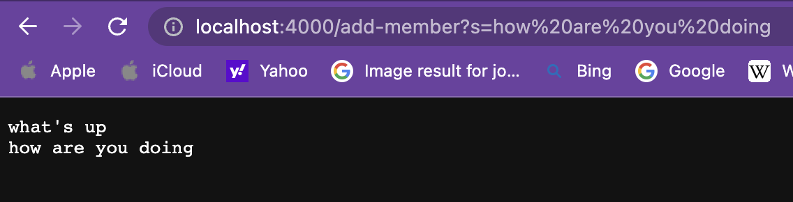

For this lab report, I chose the grep command, and I am exploring the command-line options `-i, -v, -c, -l`. I found information on this command on [wikipedia](https://en.wikibooks.org/wiki/Grep). 


<h3>Part 1</h3>
here is my code for StringServer: 
Here is the first screenshot using /add-message:  <br>
For this screenshot, the handleRequest method is called. The relevant argument is the url that is typed in. The method takes the query of the url if
the path is /add-member. Then, the substring after the '=' is taken from the query is added to our String s, which is returned. In this specific request
the value of s changes from "" to "what'sup\n". 
Here is the second screenshot using \add-message:  <br>
For this screenshot, the `handleRequest` method is called. The relevant argument is again the url that is typed in. The method takes the query of the url
if the path is `/add-member`. Then the substring after the '=' from the query is added to our String `s`, which is returned. In this specific request
the value of s changes from `"what's up"` to `"what's up\nhow are you doing\n"`
<h3>Part 2</h3>
I chose the bug in the reverseInPlace(int[] arr) method from ArrayExamples in lab3. A failure inducing input for the buggy program was:
```
@Test
  public void testReverseInPlace2() {
    int[] input1 = { 3,2,1 };
    ArrayExamples.reverseInPlace(input1);
    assertArrayEquals(new int[]{ 1,2,3 }, input1);
  }
 ```
 An input that didn't induce a failure was:
 ```
 	@Test 
	public void testReverseInPlace() {
    int[] input1 = { 3 };
    ArrayExamples.reverseInPlace(input1);
    assertArrayEquals(new int[]{ 3 }, input1);
	}
 ```
 Here is the symptom of the bug:
 
 The bug was that the for loop should only interate until halfway through the array, and we need to swap the two numbers rather than setting
 arr[i] = arr[arr.length-i-1].
 Before:
 ```
 static void reverseInPlace(int[] arr) {
    for(int i = 0; i < arr.length; i += 1) {
      arr[i] = arr[arr.length - i - 1];
    }
  }
  ```
  After:
  ```
  static void reverseInPlace(int[] arr) {
    for(int i = 0; i < arr.length/2; i += 1) {
      int temp = arr[i];
      arr[i] = arr[arr.length - i - 1];
      arr[arr.length-i-1] = temp;
    }
  }
  ```
  This fix addresses the issue because before the method would copy the right half of the array onto the left, and then copy the left onto the right,
  but the left was already set to the right, so it copies the right onto the right. Therefore, the right half of the array experiences no changes. So
  we need to swap the two terms rather than setting left = right. If we do this, then we only need to swap until halfway, since then we will be swapping twice.
  <h3>Part 3</h3>
  In lab 2, I learned how to make a local host website. I thought it was one of the coolest cs exercises I've done yet, since all my coding knowledge
  so far has simply been in an IDE and terminal. However this time, I actually got to develop a website. Even though it was extremely simple, it made me 
  feel proud for coming this far in computer science and keeps me eager to learn more. 

