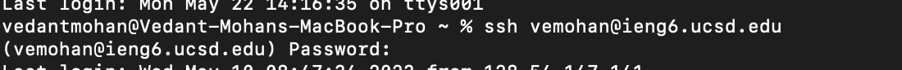
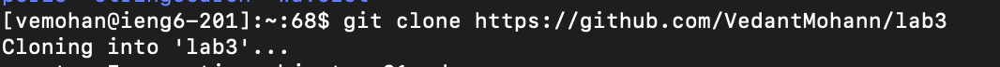
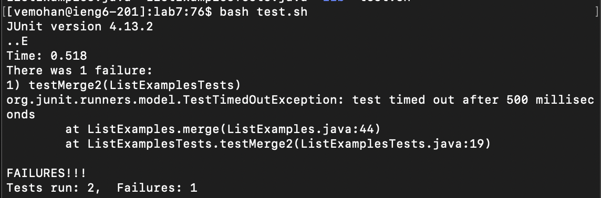
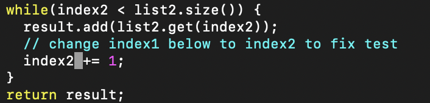
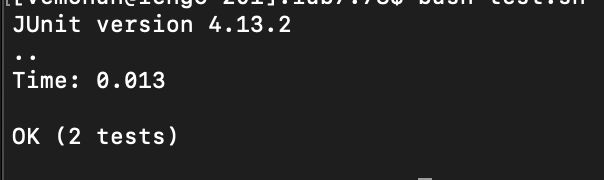
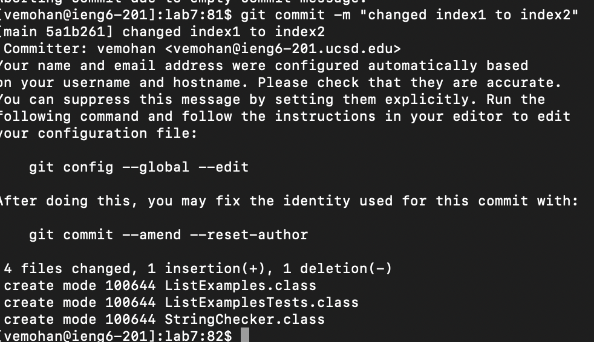

<h3>Step 4</h3>
 <br>
I typed in my log in and password

<h3>Step 5</h3>
 <br>
`git clone https: //github.com/VedantMohann/lab7`
I cloned the repository I forked

<h3>Step 6</h3>
 <br>
`bash test.sh`
running the junit test commands that are in the bash script

<h3>Step 7</h3>
 <br>
```
vim ListExamples.java
(series of <h>,<j>,<k>,<l> commands to move cursor to error)
<x> <i> <2> <esc>
<:w> <:q> <enter>
```
Debuggin the code in vim

<h3>Step 8</h3>
 <br>
`<up> <enter>`
Rerunning the junit tests, which I can access using the up arrow

<h3>Step 9</h3>
 <br>
`git commit -m "changed index1 to index2"`
Committing changes
