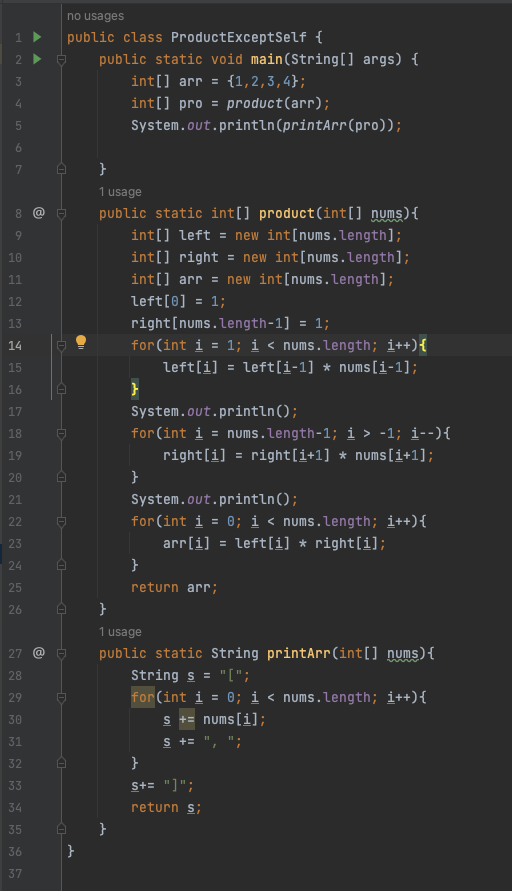
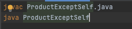
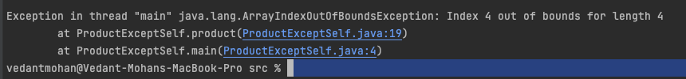
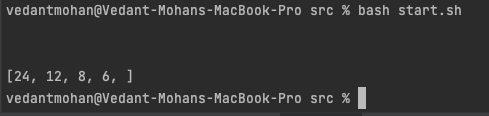

Dear TA,
I was working on a leetcode problem (#238, product of arrays except self), and I am getting an ArrayOutOfBoundsException. 
I am using IntellIJ. I put my code in a java file, and I am using a bash file to compile and run the java file. . The failure-inducing input is [1,2,3,4]. Attached are screenshots
of my code. Please let me know how I can fix my code. Thanks!
  
  
  

Dear Student,
Hi there! You might want to check the bounds of your for loop. Seems like the issue might be stemming from there. It seems
like your upper bound is too large on line 18, and you might want to try nums.length-2 instead. This is because in the first
iteration of the for loop, your code will be calling right[nums.length], which is out of bounds. 

Dear TA, 
Thanks for the help! Here is a screenshot of the output after the fix.

  

The file & Directory structure needed no changes
Here are the contents of both files before fixing the bug:

  
  
The command used to trigger the bug: `bash start.sh`
To fix the bug, we needed to change nums.length-1 to nums.length -2. This was leading to an out of bounds
exception in the first iteration of our for loop.

Reflection:
I think the coolest thing I learned from the second half of this quarter was bash scripts. It was extremely interesting
how I could write terminal code in a file, and save that file. I think bash scripts would be really useful in the future
because they enable sharing terminal code. I also really enjoyed learning how to use vim. 
